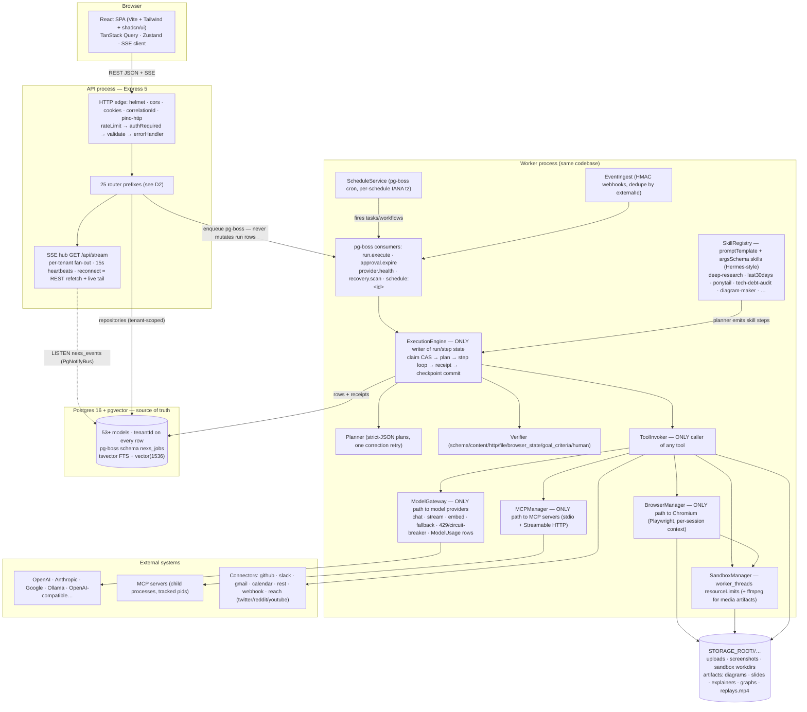
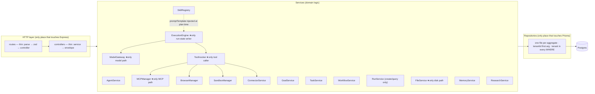
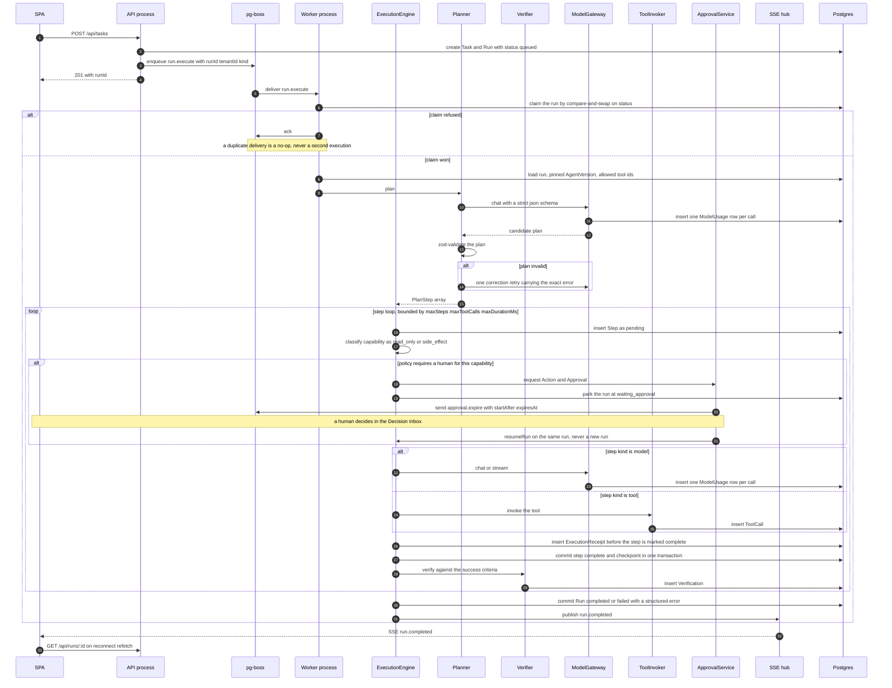
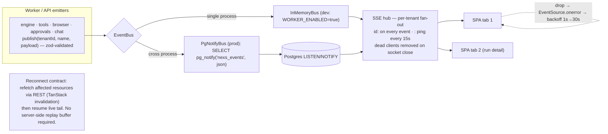
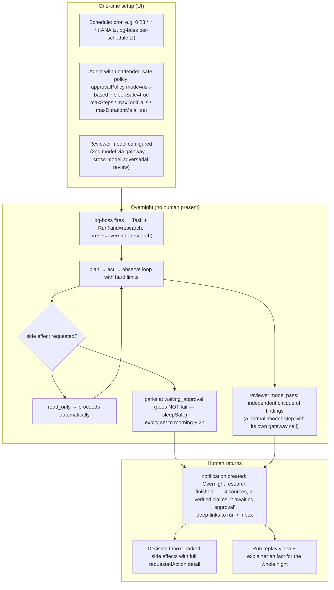

# NEXS — Architecture Diagrams

> Companion to `nexs-build-spec.md`. Canonical set of diagrams, including the additive
> Hermes-inspired surfaces (Skills, Artifacts, Unattended runs). All diagrams are
> mermaid — render in GitHub/VS Code. ASCII fallbacks included for terminal review.

---

## D1. System context (full, incl. new surfaces)



ASCII fallback:

```
 Browser SPA ──REST/SSE──▶ Express edge ──▶ 25 routers ──▶ repositories ──▶ Postgres+pgvector
                                        │                    ▲               (pg-boss, tsvector)
                                        ▼ enqueue           │ claim CAS
                                   pg-boss jobs ──▶ ExecutionEngine ──receipts──┘
                                            ├─ Planner / Verifier ──▶ ModelGateway ──▶ providers
                                            ├─ ToolInvoker ──▶ MCPManager / Browser / Sandbox / Connectors
                                            └─ SkillRegistry (Hermes-style skills)
 Worker publishes events → pg_notify → API LISTEN → SSE hub → clients
 All bytes: STORAGE_ROOT/<tenantId>/… (uploads, screenshots, artifacts, replays)
```

---

## D2. HTTP edge — router map (14 built + 11 to wire)

| Prefix | Status | Notes |
|---|---|---|
| `/api/health` | ✅ built | public |
| `/api/auth` | ✅ built | public; rate-limited 10/min/IP |
| `/api/users` | ✅ built | me / patch |
| `/api/agents` | ✅ built | CRUD + lifecycle actions + versions |
| `/api/goals` | ✅ built | verification-gated completion |
| `/api/tasks` | ✅ built | creates Run + enqueues `run.execute` |
| `/api/workflows` | ✅ built | versioned steps, activate, run |
| `/api/runs` | ✅ built | list/detail/cancel/pause/resume |
| `/api/approvals` | ✅ built | approve/reject; expiry via pg-boss |
| `/api/notifications` | ✅ built | unread count, read, read-all |
| `/api/chat` | ✅ built | SSE stream, messages, mentions (add sessions) |
| `/api/memory` | ✅ built | CRUD + hybrid search (FTS+vector) |
| `/api/research` | ✅ built | projects/runs/sources/findings (+credibility, presets) |
| `/api/stream` | ✅ built | SSE hub |
| `/api/providers` | ⬜ wire | CRUD · `POST /:id/test` · `POST /:id/sync` |
| `/api/models` | ⬜ wire | list · `PATCH /:id` (enable, capabilities) |
| `/api/tools` | ⬜ wire | registry · `GET /:id` · `POST /:id/invoke` (test) |
| `/api/mcp` | ⬜ wire | CRUD · reconnect · resources/prompts |
| `/api/connectors` | ⬜ wire | CRUD · accounts · test · oauth start/callback |
| `/api/browser` | ⬜ wire | sessions · live state · actions |
| `/api/sandbox` | ⬜ wire | sessions · executions · exec |
| `/api/events` | ⬜ wire | webhook ingest (HMAC) · subscriptions CRUD |
| `/api/schedules` | ⬜ wire | CRUD · enable/disable · next-fire times |
| `/api/files` | ⬜ wire | upload · folder attach · preview · grants |
| `/api/dashboard` | ⬜ wire | composed aggregates — zero hard-coded numbers |
| `/api/skills` | ⬜ add (new) | CRUD · versions · `POST /:id/run` (test) — Hermes-style skill registry |

Middleware chain (all routers): `rateLimit → authRequired → attachTenant → validate(zod) → controller`.
All 25 authenticated except `/api/health` and `/api/auth/*`.

---

## D3. Component boundaries & single-path rules



Rules (enforced by import tests, not convention):

- Only `ModelGateway` imports provider SDKs.
- Only `ExecutionEngine` mutates `Run`/`RunStep` rows.
- Only `ToolInvoker` executes a tool; allowlist checked at plan validation and again at invocation.
- Only repositories touch Prisma; only controllers touch HTTP.
- Skills never call tools directly — they shape the planner's output; execution still goes through the engine.

---

## D4. Execution sequence (plan → act → observe → verify)



---

## D5. SSE event flow & reconnect contract



Event catalog is locked (`@nexs/shared/events.ts`, §3.1 of the build spec). New surfaces reuse it — no new event names:

- Skill test-run → `task.created` + `run.*` (a skill run IS a task/run)
- Artifact completion → part of `run.completed` output; UI refetches via invalidation map
- Overnight digest → `notification.created`

---

## D6. Data model — aggregate map (53+ Prisma models, tenantId on every owned row)

```mermaid
erDiagram
    %% ── tenancy: every owned row carries tenantId as an indexed scalar ──
    TENANT ||--o{ USER : "owns"
    TENANT ||--o{ MODEL_PROVIDER : "owns"
    TENANT ||--o{ CREDENTIAL : "owns"
    TENANT ||--o{ MODEL : "owns"
    TENANT ||--o{ GATEWAY_ROUTE : "owns"
    TENANT ||--o{ MODEL_USAGE : "owns"
    TENANT ||--o{ TOOL : "owns"
    TENANT ||--o{ MCP_SERVER : "owns"
    TENANT ||--o{ CONNECTOR : "owns"
    TENANT ||--o{ AGENT : "owns"
    TENANT ||--o{ GOAL : "owns"
    TENANT ||--o{ TASK : "owns"
    TENANT ||--o{ WORKFLOW : "owns"
    TENANT ||--o{ SCHEDULE : "owns"
    TENANT ||--o{ EVENT : "owns"
    TENANT ||--o{ EVENT_SUBSCRIPTION : "owns"
    TENANT ||--o{ RUN : "owns"
    TENANT ||--o{ TOOL_CALL : "owns"
    TENANT ||--o{ EXECUTION_RECEIPT : "owns"
    TENANT ||--o{ VERIFICATION : "owns"
    TENANT ||--o{ ACTION : "owns"
    TENANT ||--o{ APPROVAL : "owns"
    TENANT ||--o{ CHAT_SESSION : "owns"
    TENANT ||--o{ CHAT_MESSAGE : "owns"
    TENANT ||--o{ MEMORY : "owns"
    TENANT ||--o{ BROWSER_SESSION : "owns"
    TENANT ||--o{ SANDBOX_SESSION : "owns"
    TENANT ||--o{ RESEARCH_PROJECT : "owns"
    TENANT ||--o{ SKILL : "owns"
    TENANT ||--o{ ATTACHMENT : "owns"
    TENANT ||--o{ FOLDER_GRANT : "owns"
    TENANT ||--o{ NOTIFICATION : "owns"
    TENANT ||--o{ CHANNEL : "owns"
    TENANT ||--o{ CHANNEL_ACCOUNT : "owns"
    TENANT ||--o{ ACCESS_GROUP : "owns"
    TENANT ||--o{ PAIRING_REQUEST : "owns"
    TENANT ||--o{ DEVICE : "owns"
    TENANT ||--o{ DEVICE_TOKEN : "owns"
    TENANT ||--o{ BINDING : "owns"
    TENANT ||--o{ PLUGIN : "owns"
    TENANT ||--o{ EXEC_ALLOWLIST_RULE : "owns"

    %% ── identity ──
    USER ||--o{ REFRESH_TOKEN : "issues"
    USER ||--o{ PASSWORD_RESET : "requests"
    USER ||--o{ NOTIFICATION : "receives"

    %% ── gateway, models, spend ──
    MODEL_PROVIDER ||--o{ MODEL : "offers"
    MODEL ||--o{ MODEL_USAGE : "billed as"
    RUN |o--o{ MODEL_USAGE : "spends on"

    %% ── tools, MCP, connectors ──
    MCP_SERVER ||--o{ MCP_TOOL : "exposes"
    MCP_SERVER |o--o{ TOOL : "projects into"
    CONNECTOR ||--o{ CONNECTOR_ACCOUNT : "authorises"

    %% ── control plane ──
    AGENT ||--o{ AGENT_VERSION : "versions"
    GOAL |o--o{ TASK : "decomposes into"
    WORKFLOW ||--o{ WORKFLOW_VERSION : "versions"
    WORKFLOW_VERSION ||--o{ WORKFLOW_STEP : "contains"
    EVENT |o--o{ EVENT_SUBSCRIPTION : "matched by"
    AGENT |o--o{ RUN : "executes"
    AGENT_VERSION |o--o{ RUN : "pins"
    TASK |o--o{ RUN : "spawns"

    %% ── execution chain ──
    RUN ||--o{ STEP : "contains"
    RUN |o--o{ TOOL_CALL : "records"
    STEP |o--o{ TOOL_CALL : "makes"
    TOOL ||--o{ TOOL_CALL : "invoked as"
    TOOL_CALL ||--o{ EXECUTION_RECEIPT : "proves"
    RUN |o--o{ VERIFICATION : "checked by"

    %% ── approvals ──
    ACTION ||--o{ APPROVAL : "awaits"

    %% ── chat ──
    CHAT_SESSION |o--o{ CHAT_MESSAGE : "contains"
    RUN |o--o{ CHAT_MESSAGE : "answers"

    %% ── runtime sessions ──
    SANDBOX_SESSION ||--o{ SANDBOX_EXECUTION : "runs"

    %% ── research ──
    RESEARCH_PROJECT ||--o{ RESEARCH_RUN : "attempts"
    RESEARCH_RUN ||--o{ RESEARCH_SOURCE : "reads"
    RESEARCH_RUN ||--o{ RESEARCH_FINDING : "asserts"

    %% ── skills ──
    SKILL ||--o{ SKILL_VERSION : "versions"

    %% ── channels, devices (v2) ──
    CHANNEL ||--o{ CHANNEL_ACCOUNT : "authenticates"
    DEVICE ||--o{ DEVICE_TOKEN : "holds"
```



**Ownership shape.** 56 models today. 41 carry `tenantId` as the first indexed column and are
drawn with an `owns` edge above. The other 15 are child rows scoped through a parent rather than
directly by tenant — `RefreshToken`, `PasswordReset` (via `User`), `AgentVersion` (via `Agent`),
`WorkflowVersion` / `WorkflowStep` (via `Workflow`), `MCPTool` (via `McpServer`), `ConnectorAccount`
(via `Connector`), `Step` (via `Run`), `SandboxExecution` (via `SandboxSession`), `ResearchRun`
(via `ResearchProject`), `ResearchSource` / `ResearchFinding` (via `ResearchRun`), `SkillVersion`
(via `Skill`), plus `Tenant` itself. Every edge above is a declared Prisma relation; `tenantId`
itself is deliberately a plain indexed scalar, never a relation — which is what makes tenant
isolation structural instead of conventional.

Invariants: `Goal.completed` refused without passing `goal_criteria` Verification · `Run.agentVersionId`
frozen at start · side-effecting `ToolCall` requires `ExecutionReceipt` before step complete ·
embedding dimension validated at write time.

---

## D7. Skills & artifacts pipeline (new — Hermes-inspired, additive)

```mermaid
flowchart TB
    subgraph Registry["Skill registry (DB rows, zero new infra)"]
        S1["deep-research (8-phase, credibility scoring)"]
        S2["last30days (recency window + platform sources)"]
        S3["user-research (interviews/surveys synthesis)"]
        S4["ponytail (minimal-code policy) · tech-debt-audit · humanizer · napkin/runbook-keeper"]
        S5["diagram-maker (SVG/mermaid) · slides-builder (HTML deck) · code-explainer (knowledge graph) · seo-audit"]
    end
    subgraph Plan["Planner"]
        P["skill stepType resolved at plan time:<br/>promptTemplate + argsSchema → strict-JSON PlanStep[]<br/>(same validation ladder, same allowlist gates)"]
    end
    subgraph Exec["Engine executes as normal steps"]
        X["model / tool / browser / sandbox steps<br/>→ ToolCall rows, receipts, verifications — all real"]
    end
    subgraph Artifacts["Artifact writers (FileService only path to disk)"]
        A1["diagram: svg/png/mermaid"]
        A2["slides: self-contained HTML deck"]
        A3["explainer: run plan-audit page (HTML)"]
        A4["graph: knowledge-graph JSON + interactive HTML"]
        A5["report: TECH_DEBT_AUDIT.md / research report (JSON/MD)"]
        A6["replay: run-replay MP4 — BrowserManager screenshots + step timeline via sandbox ffmpeg (probe-first, verify-last)"]
    end
    DISK[("STORAGE_ROOT/<tenantId>/artifacts/<runId>/…")]
    UI["Artifacts tab in Run workspace:<br/>ArtifactViewer renders by type (mermaid / iframe preview / video player)<br/>Copy as JSON · Copy as MD · Download"]
    Registry --> P --> X --> Artifacts --> DISK --> UI
```



Rules: artifacts are bytes on disk referenced from `ExecutionReceipt.outputRef` /
`ResearchRun.resultRef` — the UI never renders derived state. Artifact generation is a normal step:
it costs tokens, shows in the timeline, can fail and be retried like any other step.

---

## D8. Unattended runs (ARIS pattern — "research while you sleep")



Why this is the flagship demo of NEXS's core guarantee: a multi-hour, multi-step, side-effecting
workload that survives restarts, never double-fires effects, asks a human only when it must, and
proves completion with verifications + receipts.
